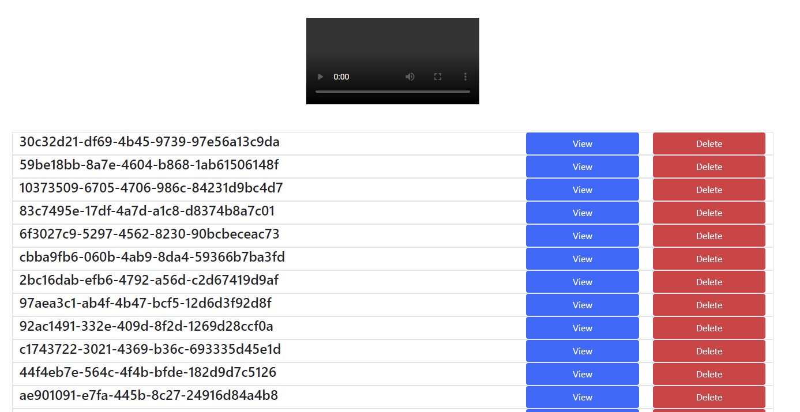

# Golang Video API
``https://video.techytechster.com/`` -> Example Deployment
If you need to proxy a bunch of videos that you like and want to be able to send them to people this is a solution.

## Admin Site
- http/s://domain.com/admin
The admin site is secured by sessions, the password is configured through the environment variable "ADMINPASSWORD"

## API Endpoints
- "/" -> "Redirect To /api/v1/video.mp4"
- "/api/v1/videos" -> "Get All Videos (Authenticated)"
- "/api/v1/videos" -> "Create Video (Authenticated)"
- "/api/v1/videos/:id" -> "Get Specific Video (.mp4 is ignored) GET"
- "/api/v1/videos/:id" -> "Remove Video (Authenticated) DELETE"
- "/api/v1/video.mp4" -> "Get random video"
- "/api/v1/videos/discord" -> "Return a html page containing OG Data for discord"
- "/admin" -> "Return admin page"
- "/api/v1/login" -> "Login endpoint attach session"
- "static/favicon.ico" -> "Favicon endpoint"
- "/style.css" -> "CSS endpoint"
- "/admin.css" -> "Admin CSS Endpoint"

## Tech Stack
- Golang API & SSR Frontend on port 1323
- Redis Datastore (Private Port not exposed)